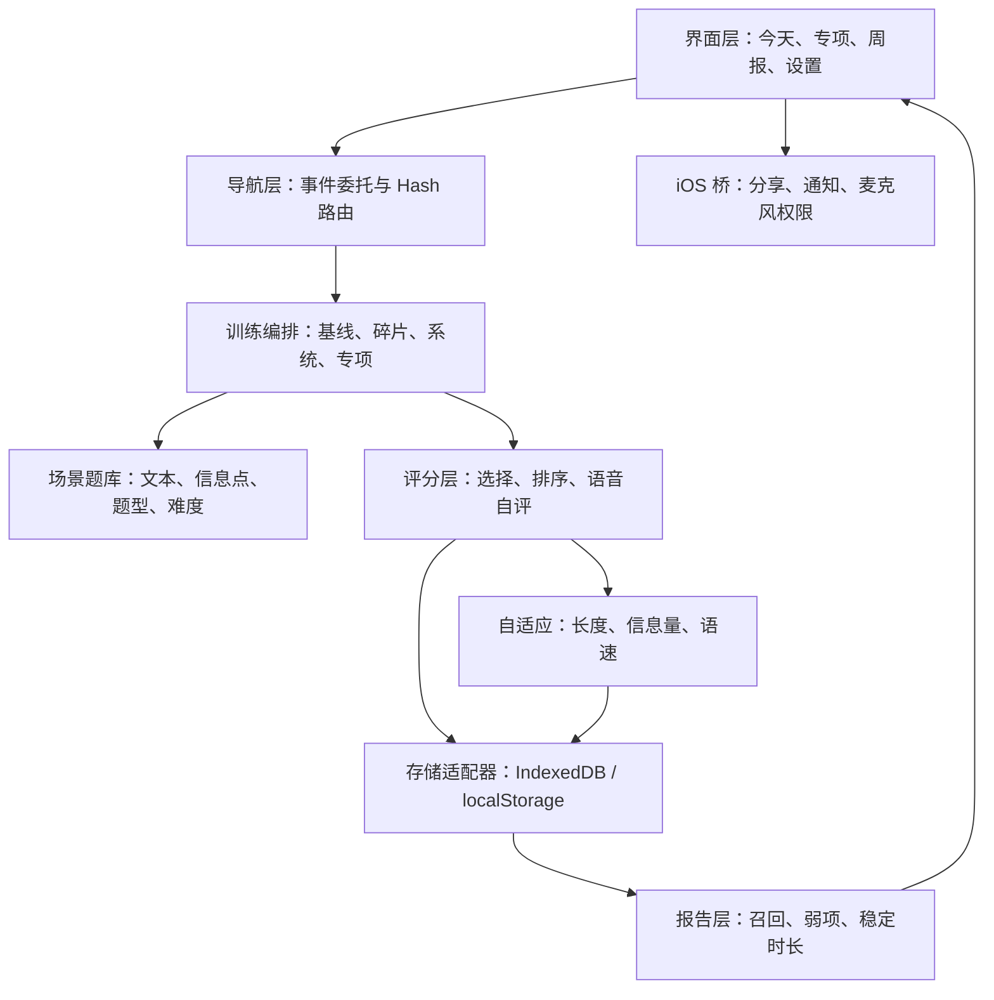

# 聆听训练：迭代计划与架构说明

## 产品闭环

每个用户可见入口必须完成以下闭环：

1. 入口可点击，并显示本次训练目标。
2. 播放普通话工作对话，答案在播放前保持隐藏。
3. 用户通过选择、排序或口头复述作答。
4. 系统按信息点给出反馈并保存记录。
5. 周报读取记录，生成弱项和下一步建议。

纯说明内容必须明确标记为说明，不使用可点击卡片的视觉样式。

## 功能模块

| 模块 | 输入 | 处理 | 输出 |
| --- | --- | --- | --- |
| 基线测试 | 4 个递增长度场景 | 估算稳定时长和起始难度 | 训练档案 |
| 碎片训练 | 当前难度 | 抽取 3 个不同题型 | 约 5 分钟训练记录 |
| 系统训练 | 当前难度、最近题目 | 抽取 7 题并执行自适应 | 完整训练记录 |
| 边听边压缩 | `focus=chunk` 场景 | 人物、任务、条件、时间、原因分块 | 结构保持能力 |
| 渐进式提速 | `focus=speed` 场景 | 在当前语速上增加 0.08 倍 | 快速语音适应能力 |
| 理解与应答 | `focus=response` 场景 | 语音复述和逐信息点自评 | 应答组织能力 |
| 周报 | 本周训练记录 | 聚合细节召回、时长和遗漏类型 | 趋势与建议 |
| 设置 | 目标、语速、提醒时间 | 本地持久化并调用 iOS 通知桥 | 个性化训练环境 |

## 分层架构

## 数据边界

- `Scenario`：训练材料、信息点、题型、专项、难度和标准答案。
- `Attempt`：题目、分数、重听次数、回答延迟、命中及遗漏类型。
- `TrainingProfile`：基线结果和当前自适应难度。
- `Settings`：每周目标、基础语速、提醒开关和提醒时间。
- 录音只生成本次会话的临时对象 URL，退出题目后释放，不写入数据库。

## iOS 兼容策略

- 默认使用 IndexedDB；若 WKWebView 自定义协议不支持，则自动切换 localStorage。
- JSON 导出通过 `shareBackup` 原生桥打开 iOS 分享面板。
- 训练提醒通过 `scheduleReminder` 原生桥安排本地通知。
- 麦克风权限由 `WKUIDelegate` 和 `NSMicrophoneUsageDescription` 共同处理。
- 网页层不保存 Apple ID、模型密钥或录音文件。

## 迭代与验收

1. 完成功能接线：所有首页入口、导航、设置和导出均有真实行为。
2. 自动化验证：覆盖四种训练模式、三种题型、存储降级和周报刷新。
3. iOS 构建验证：检查显示名、Bundle ID、Web 资源、通知和麦克风声明。
4. 设备验收：在 iPhone 上逐项点击，完成一题并确认周报出现记录。

发布门槛：任何可见入口若没有行为、结果或明确禁用说明，不得进入 IPA 构建。

## v1.1 当前实现状态

- 已接通：首页三个专项、碎片训练、系统训练、周报、设置、导出、重置和帮助入口。
- 已验证：五种训练模式、选择/排序/语音自评三种题型、训练记录写入、周报刷新和兼容存储降级。
- iOS 增强：原生分享面板、本地训练通知、麦克风权限桥接；应用版本 `1.1.0 (10)`。
- 待设备验收：用 AltStore 覆盖安装后，确认通知授权、录音回放及后台通知到达。
